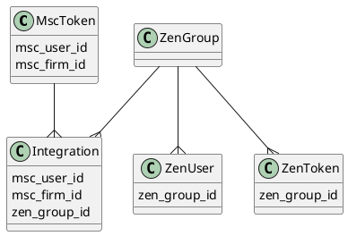
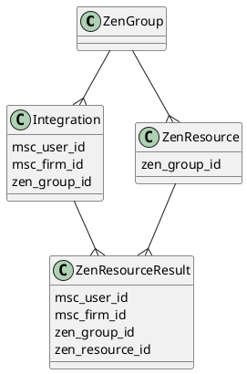
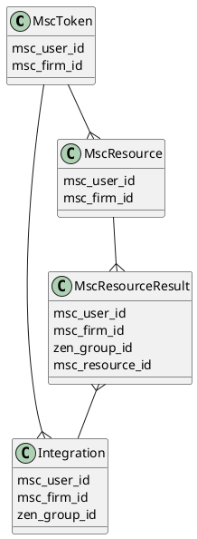

# Тренировочный проект Lumen

Площадка для экспериментов по созданию приложения-интеграции на базе [Lumen framework][lumen].

В рамках эксперимента проводится интеграция между [ZenMoney API][zen-money-api]
и [MySmartChoice core][msc-core] (в дальнейшем MSC).

## Принцип работы

Потоки данных в интеграции разделены на 5 составляющих:

* Одновременная загрузка и выгрузка данных ZenMoney
* Отправка данных в MSC
* Обработка webhooks от MSC
* Ежедневная контрольная сверка изменений в MSC
* Ежедневная контрольная сверка изменений в ZenMoney

В плюсы такого подхода можно записать:

* Удобство разделения потоков данных, что делает систему более надёжной, а отладку - лёгкой
* Возможность в любой момент перезапустить обработку "сырых" данных, если на то появится необходимость
* Благодаря контрольным сверкам мы всегда будем знать, если в системе существуют проблемы

В минусы:

* Требуется хранить огромное количество данных
* Требуется поддерживать большее количество кода,
  чем при прямой пересылке данных из одного сервиса в другой

## Основные модели их взаимосвязи

Для начала, необходимо указать что за данные обрабатываются в процессе,
а также указать как их связь в рамках данного проекта, так и между проектами.

### Авторизация

Оба сервиса используют [OAuth 2.0][oauth-mail-ru] для авторизации,
поэтому принцип работы авторизации схож (но не полностью одинаков).

#### Общие черты
* необходимость наличия endpoint-ов для callback-uri
* необходимость наличия endpoint-ов для переадресации на авторизацию
* такие аттрибуты токенов, как:
  * type = Bearer
  * expires_at - дата, в которую истечёт срок действия токена
    > ZenMoney возвращает дату, значительно превышающую
    > вместимость timestamp (2089-09-14 23:31:39),
    > поэтому это поле имеет тип DateTime.
  * access - непосредственно сам ключ доступа
  * refresh - ключ, с помощью которого можно обновить токен

#### Но есть и различия
* Токен в MSC выдаётся пользователем на доступ к данным
  определённой фирмы, что выразилось в наличии полей `user_id` & `firm_id`
* В то же время ZenMoney не раскрывает какому именно пользователю принадлежит,
  однако в рамках приложения ZenMoney нет разделения прав,
  поэтому связь с пользователями ZenMoney хранится в отдельной таблице

#### Процесс авторизации

* Авторизация начинается в MSC, когда пользователь нажимает на кнопку "авторизоваться".
* Пользователь направляется на специальную страницу с GET параметрами `user_id`, `firm_id` и `redirect_to`
* Интеграция формирует state и другие параметры, необходимые для авторизации,
  после чего направляет пользователя в MSC
* В MSC происходит проверка возможности пользователя получить токен доступа к указанной фирме,
  затем отображается интерфейс с описанием предоставляемых доступов,
  а также двумя кнопками "разрешить" и "отклонить"
* При нажатии на кнопку "разрешить" пользователь будет перенаправлен на callback-uri,
* Которая, после успешного обмена кода на токен, направит его авторизоваться в ZenMoney,
  зашифровав в state `user_id`, `firm_id` и `redirect_to` для последующего связывания
  полученного токена ZenMoney с токеном пользователя
* После ввода своего логина и пароля от ZenMoney, пользователь будет перенаправлен на
  callback-uri для ZenMoney,
* Скрипт этой страницы:
  * обменивает код ZenMoney на токен,
  * получает информацию о пользователях
  * при необходимости создаёт или обновляет группу
  * при необходимости создаёт или обновляет интеграцию
  * перенаправляет пользователя на `redirect_to` страницу

### Интеграция

На стыке двух авторизаций и возникает интеграция,
которая может иметь собственные настройки.

ZenGroup - искусственная сущность, которая позволяет однозначно определить
как связать данные ZenMoney и MSC.

Такая структура хранения позволяет подключать в MSC одновременно несколько
фирм к данным одного аккаунта ZenMoney, в то же время, мы можем избежать
загрузки одних и тех же данных из ZenMoney, тем самым снижая количество
взаимодействий с внешним API.

### Ресурсы ZenMoney

Данные всех аккаунтов ZenMoney постоянно выгружаются в таблицу для хранения
сырой информации, т.е. во время выгрузки мы никак не модифицируем данные,
лишь сохраняем их у себя с пометкой, что они принадлежат определённой
группе пользователей ZenMoney.

Схема моделей, участвующих в обработке ресурсов (исключая авторизацию)

#### Процесс выгрузки из сервиса ZenMoney

Выгрузка происходит по следующему алгоритму:

* Проходимся по списку интеграций
* Для каждой интеграции, по цепочке связей находим первый токен,
  с помощью которого удастся выгрузить данные
* Выгруженные данные сохраняются в таблицу ресурсов, с мета-информацией, полезной
  при обработке ресурса:
  * Идентификатор группы (`zen_group_id`), которой принадлежит ресурс
  * Тип ресурса (аккаунт, транзакция и т.д.)
  * Идентификатор ресурса в ZenMoney
  * Флаг, сигнализирующий о том, что сущность была окончательно удалена в ZenMoney
  * JSON с данными, пришедшими от ZenMoney

#### Процесс отправки ресурсов в MSC

Алгоритм отправки ресурсов:

* Проходимся по списку интеграций
* Для каждой интеграции находим список не отправленных
  ресурсов (нет записи в `ZenResourceResult`, либо в записи
  указано, что при отправке произошла ошибка)
* Каждый ресурс отправляется HTTP запросом в MSC
* После чего создаётся пометка о том, что ресурс обработан,
  либо записывается информация об ошибке

### Ресурсы MSC

MSC, в отличие от ZenMoney, кроме прямого механизма выгрузки данных,
умеет оповещать об изменениях посредством механизма WebHooks.

Для приёма хуков существует специальный callback,
который регистрирует в системе информацию об изменённой сущности.

Схема моделей, участвующих в обработке ресурсов:

#### Процесс сохранения данных из сервиса MSC

Когда приходит WebHook от MSC, сохраняем содержащиеся в нём
данные практически в том же виде, в каком они были присланы,
извлекая при этом необходимую мета-информацию:

* `msc_user_id` & `msc_firm_id`
* Тип ресурса (аккаунт, транзакция и т.д.)
* Идентификатор ресурса в MSC

#### Процесс отправки ресурсов в ZenMoney

Алгоритм отправки ресурсов:

* Проходимся по списку интеграций
* Для каждой интеграции находим список не отправленных
  ресурсов (нет записи в `MscResourceResult`)
* Пачками отправляется HTTP запросом в MSC
* После чего создаётся пометка о том, что ресурсы обработаны,
  либо размер пачка делится на 2 части, после чего повторяется попытка отправки
* Предыдущий пункт повторяется до тех пор, пока данные не загрузятся без ошибок,
  при неудачной же попытке отправить единственный ресурс,
  создаётся результат с пометкой об ошибке

В отличие от отправки в MSC, не обработанные ресурсы отправляются отдельно от
ресурсов, которые ранее не удалось отправить.
Это сделано для того, чтобы предотвратить вероятность перемешивания
повреждённых и корректных данных.

### Результаты сверок

В идеальном мире, SLA любого приложения близко к 100%,
но мы живём не в идеальном мире.

Чтобы убедиться, что никакие данные не потерялись,
создан дополнительный мониторинг в виде ежедневных сверок.

Результат сверки по каждому сервису хранится в отдельных сущностях,
при этом алгоритм их работы схож:

* Мы получаем количество/список изменений которые должны были сохраниться у нас
* Сравниваем с тем, что у нас действительно сохранено
* Записываем результат сверки, либо ошибку, если в процессе получения данных возникла ошибка
* Если у нас данных больше, то отправляем уведомление ответственному за интеграцию
* Если же в сервисе данных больше, то дописываем недостающие данные

Если в какой-то из дней данных в базе оказалось меньше, чем должно быть,
то на следующий день происходит сверка как за текущий, так и за предыдущий день.

В случае, если результат сверки предыдущего дня показал
расхождение, необходимо уведомить ответственного за интеграцию

[lumen]: https://lumen.laravel.com/docs
[zen-money-api]: https://github.com/zenmoney/ZenPlugins/wiki/ZenMoney-API
[msc-core]: https://github.com/Bolid1/mysmartchoice-core
[oauth-mail-ru]: https://habr.com/ru/company/mailru/blog/115163/
